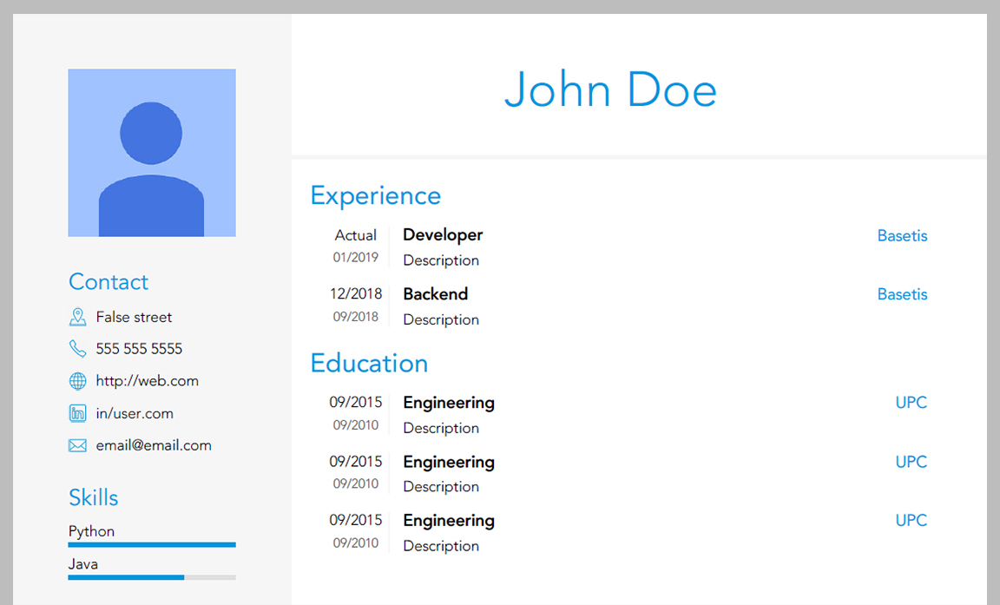

# Easy CV

Create a `pdf` CV based on some `html` templates and data from `yaml`.

Screenshot of the result:


You can view the full pdf [here](assets/sample.pdf).

## Installation
1. Install all python packages with

	pip install -r requirements.txt

2. Install [wkhtmltopdf](https://wkhtmltopdf.org/)

## Usage

### 0. Install with poetry

```
pip install poetry
poetry install
```

### 1. Create your CVs

Copy `input/sample_1.yaml` and rename it to whatever you like. For example `input/cv1.yaml`.

### 2. Start Flask
Start the `flask` server from the root folder with:

```
poetry run python cv/index.py
```

### 3. Preview the result
Open `http://localhost:5000/` to preview the result

You can also view any file (like `cv1.yml`) from the `input` folder with the url `http://localhost:5000/v/cv1`.

### 4. Create the pdf

To create the pdf for all `yaml` files inside the `input/` folder run from the main path:

```
poetry run python cv/do_all.py
```

> You should change the `wkhtmltopdf` path inside `config.py` and/or `create_sample.sh`.

> Also you need to have `flask` running

## Configuration
There are two files to `input/sample_1.yaml` and `cv/config.yaml`.

The first one (`sample_1.yaml`) has the actual content of the CV.
The second (`config.yaml`) allow users to change some parts of the template.

If you want further configuration you can edit the templates (`cv/templates/base.html` and `cv/templates/cv.html`) directly or create your own templates (recommended).

## Authors
* [Arnau Villoro](villoro.com)

## License
The content of this repository is licensed under a [MIT](https://opensource.org/licenses/MIT).
