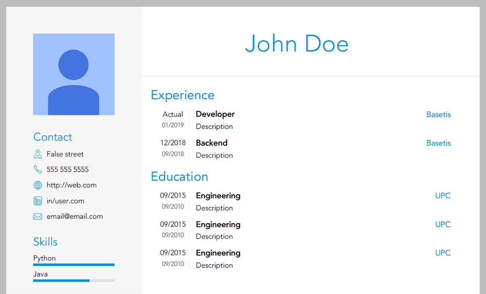

# Easy CV

Create a `pdf` CV from `yaml` data, rendered by a static [Astro](https://astro.build/)
site and exported to PDF with headless Chromium ([Playwright](https://playwright.dev/)).

Screenshot of the result:


You can view the full pdf [here](assets/sample.pdf).

## Installation

1. Install [Node.js](https://nodejs.org/) (v18+).
2. Install the dependencies and the Chromium browser used for PDF export:

```
npm install
npx playwright install chromium
```

## Usage

### 1. Create your CVs

Copy `sample/input/sample_1.yaml` and rename it to whatever you like, e.g.
`sample/input/cv1.yaml`. Each YAML file produces one CV.

By default the site reads from `sample/input/`. To use a different folder (for
example a private one) set the `CV_DATA_DIR` environment variable:

```
# PowerShell
$env:CV_DATA_DIR = "cv_private/input"
```

### 2. Preview in the browser

```
npm run dev
```

- `http://localhost:4321/` — the default CV (`sample_1`).
- `http://localhost:4321/v/<name>` — any CV from the input folder (e.g. `/v/cv1`).
- `http://localhost:4321/print/<name>` — the frameless, print-ready version.

### 3. Create the PDFs

Build the site and export every CV in the input folder to PDF:

```
npm run build:pdf
```

PDFs are written to `sample/output/` by default (override with the `CV_OUTPUT_DIR`
environment variable). `npm run pdf` exports without rebuilding if `dist/` is
already up to date.

## Configuration

Each CV's `yaml` file holds both the **content** and a `config` block that controls
the look (page size, theme colour, sidebar width, spacings — all in millimetres).
Pick the layout with the top-level `template` field:

- `cv_no_bars` — sidebar with expertise/key-skills as lists, languages as bars.
- `cv_with_bars` — sidebar with expertise/programming/languages all as bars.
- `cover` — a standalone full-width cover page.

The layouts and their CSS live in `src/layouts/`, `src/components/`, and
`src/lib/styles.ts`. The contact-icon theme is chosen with `config.theme_color_name`
(a folder under `public/icons/`).

## Profile / contact images

Images referenced by `image_uri` are served from `public/` (e.g.
`image_uri: images/me.png` → `public/images/me.png`). The optional image-processing
pipeline in `utilities/` (Python) can generate these; point its `folder_out` at
`public/images`.

## Authors
* [Arnau Villoro](villoro.com)

## License
The content of this repository is licensed under a [MIT](https://opensource.org/licenses/MIT).
