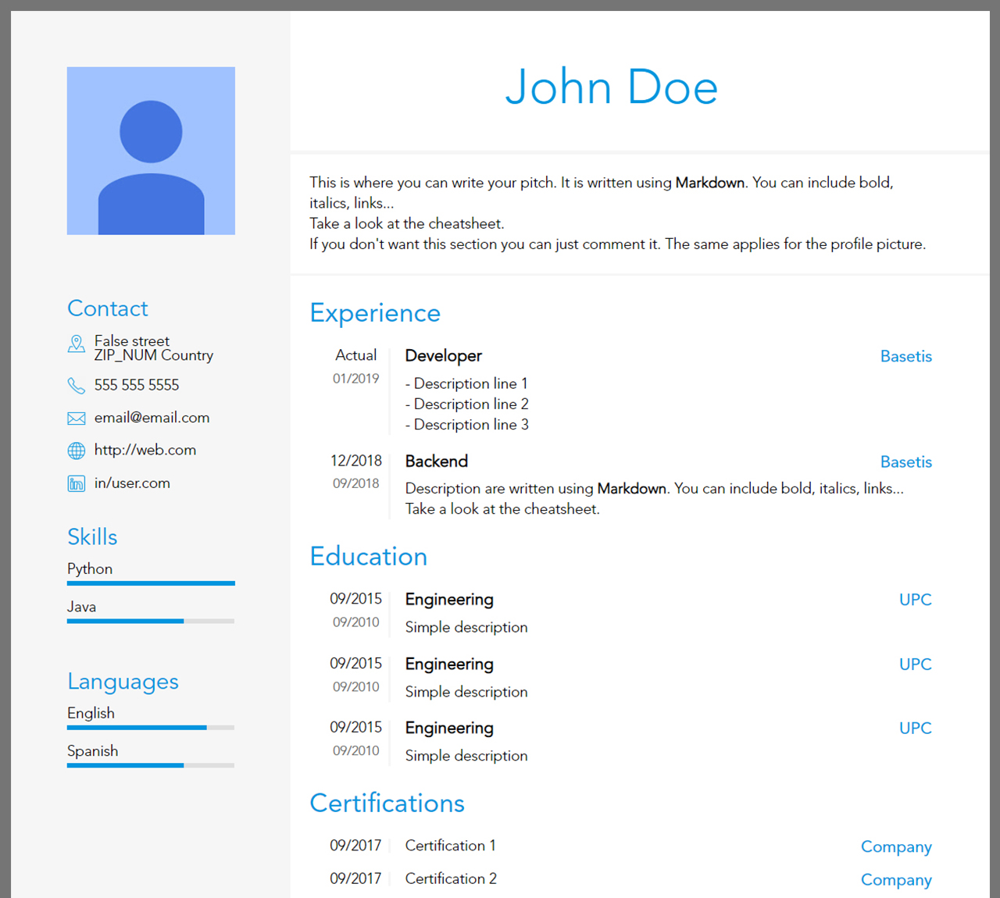

# Easy CV

Create a `pdf` CV based on some `html` templates and data from `yaml`.

Screenshot of the result:

You can view the full pdf [here](assets/sample.pdf).

## Installation
1. Install all python packages with

	pip install -r requirements.txt

2. Install [wkhtmltopdf](https://wkhtmltopdf.org/)

## Usage

### 1. Create your CVs

Copy `src/sample_data.yaml` to the folder `input` and rename it to whatever you like. For example `input/cv1.yaml`.

### 2. Start Flask
Start the `flask` server from the root folder with:

	python src/index.py

### 3. Preview the result
Open `http://localhost:5000/` to preview the result

You can also view any file (like `cv1.yml`) from the `input` folder with the url `http://localhost:5000/cv1`.

### 4. Create the pdf

With `create_sample.sh` you can create the `assets/sample.pdf`

To create the pdf for all `yaml` files inside the `input/` folder run from the main path:

	python src/do_all.py

> You should change the `wkhtmltopdf` path inside `config.py` and/or `create_sample.sh`.

## Configuration
There are two files to `src/sample_data.yaml` and `src/config.yaml`.

The first one (`sample_data.yaml`) has the actual content of the CV.
The second (`config.yaml`) allow users to change some parts of the template.

If you want further configuration you can edit the templates (`src/templates/base.html` and `src/templates/cv.html`) directly or create your own templates (recommended).

## Authors
* [Arnau Villoro](villoro.com)

## License
The content of this repository is licensed under a [MIT](https://opensource.org/licenses/MIT).

## Nomenclature
Branches and commits use some prefixes to keep everything better organized.

### Branches
* **f/:** features
* **r/:** releases
* **h/:** hotfixs

### Commits
* **[NEW]** new features
* **[FIX]** fixes
* **[REF]** refactors
* **[PYL]** [pylint](https://www.pylint.org/) improvements
* **[TST]** tests
